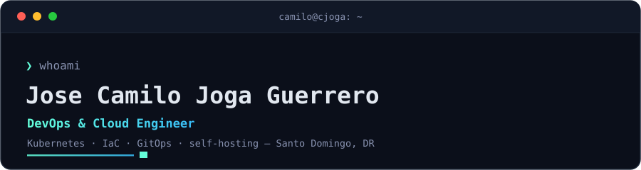

<!-- Profile README for github.com/Camilool8 — the "from the handbook" block is refreshed by .github/workflows/update-writing.yml -->

  <picture>
    <source media="(prefers-color-scheme: dark)" srcset="./assets/header-dark.svg">
    <source media="(prefers-color-scheme: light)" srcset="./assets/header-light.svg">
    
  </picture>

## `❯ whoami`

DevOps & Cloud Engineer. I build and run Kubernetes platforms on AWS and Azure,
and self-host the rest on a K3s homelab.
Infrastructure as Code, GitOps, observability — turning manually-managed sprawl
into platforms teams can run themselves.

## `❯ what I'm building`

- **A six-node K3s homelab** that runs [cjoga.cloud](https://cjoga.cloud) and [blog.cjoga.cloud](https://blog.cjoga.cloud) — Tailscale mesh, Envoy Gateway, Cloudflare Tunnel, self-healing on an Ansible playbook. → [how it's wired](https://blog.cjoga.cloud/me/opinions/self-hosting-privilege)
- **[KODEPULL](https://kodepull.com)** — my software company: enterprise-quality engineering on small-business budgets.
- **The Kubestronaut path** — KCNA done, CKAD next.

## `❯ stack`

![Azure][b-azure]

## `❯ featured`

|  |  |
| --- | --- |
| **[cjoga-portfolio](https://github.com/Camilool8/cjoga-portfolio)** The React + Vite site behind cjoga.cloud, with a live Kubernetes terminal. | **[RHCSA-LAB](https://github.com/Camilool8/RHCSA-LAB)** A Vagrant lab that maps every EX200 objective to a break-it / fix-it task. |
| **[RHCE-LAB](https://github.com/Camilool8/RHCE-LAB)** The Ansible-automation companion lab for the RHCE (EX294). | **[JOBSEARCHBOT](https://github.com/Camilool8/JOBSEARCHBOT)** A Discord bot that surfaces remote roles from LinkedIn, daily. |

## `📡 from the handbook`

Latest from [blog.cjoga.cloud](https://blog.cjoga.cloud) — opinions I'd defend in a code review, and the cert guides I actually walked.

<!-- WRITING:START -->
- **[RHCE (EX294) guide](https://blog.cjoga.cloud/learn/rhce)** &nbsp;·&nbsp; _guide_ &nbsp;·&nbsp; 2026-07-05
- **[AI in DevOps — be a power user, not a casual one](https://blog.cjoga.cloud/me/opinions/ai-in-devops-power-user)** &nbsp;·&nbsp; _opinion_ &nbsp;·&nbsp; 2026-05-13
- **[Certifications expire, and that's the point](https://blog.cjoga.cloud/me/opinions/certifications-expire)** &nbsp;·&nbsp; _opinion_ &nbsp;·&nbsp; 2026-05-13
- **[Keep it stupidly simple](https://blog.cjoga.cloud/me/opinions/keep-it-stupidly-simple)** &nbsp;·&nbsp; _opinion_ &nbsp;·&nbsp; 2026-05-13
- **[OpenBao over Vault — same docs, more freedom](https://blog.cjoga.cloud/me/opinions/openbao-over-vault)** &nbsp;·&nbsp; _opinion_ &nbsp;·&nbsp; 2026-05-13
<!-- WRITING:END -->

## `❯ connect`

[![LinkedIn][b-linkedin]](https://www.linkedin.com/in/cjoga)

[b-azure]: https://img.shields.io/badge/Azure-1a2332?style=flat-square&labelColor=1a2332&logo=data%3Aimage%2Fsvg%2Bxml%3Bbase64%2CPHN2ZyBmaWxsPSIjNjRmZmRhIiByb2xlPSJpbWciIHZpZXdCb3g9IjAgMCAyNCAyNCIgeG1sbnM9Imh0dHA6Ly93d3cudzMub3JnLzIwMDAvc3ZnIj48dGl0bGU%2BTWljcm9zb2Z0IEF6dXJlPC90aXRsZT48cGF0aCBkPSJNMjIuMzc5IDIzLjM0M2ExLjYyIDEuNjIgMCAwIDAgMS41MzYtMi4xNHYuMDAyTDE3LjM1IDEuNzZBMS42MiAxLjYyIDAgMCAwIDE1LjgxNi42NTdIOC4xODRBMS42MiAxLjYyIDAgMCAwIDYuNjUgMS43NkwuMDg2IDIxLjIwNGExLjYyIDEuNjIgMCAwIDAgMS41MzYgMi4xMzloNC43NDFhMS42MiAxLjYyIDAgMCAwIDEuNTM1LTEuMTAzbC45NzctMi44OTIgNC45NDcgMy42NzVjLjI4LjIwOC42MTguMzIuOTY2LjMybS0zLjA4NC0xMi41MzEgMy42MjQgMTAuNzM5YS41NC41NCAwIDAgMS0uNTEuNzEzdi0uMDAxaC0uMDNhLjU0LjU0IDAgMCAxLS4zMjItLjEwNmwtOS4yODctNi45aDQuODUzbTYuMzEzIDcuMDA2Yy4xMTYtLjMyNi4xMy0uNjk0LjAwNy0xLjA1OEw5Ljc5IDEuNzZhMS43MjIgMS43MjIgMCAwIDAtLjAwNy0uMDJoNi4wMzRhLjU0LjU0IDAgMCAxIC41MTIuMzY2bDYuNTYyIDE5LjQ0NWEuNTQuNTQgMCAwIDEtLjMzOC42ODQiLz48L3N2Zz4%3D
[b-linkedin]: https://img.shields.io/badge/LinkedIn-1a2332?style=flat-square&labelColor=1a2332&logo=data%3Aimage%2Fsvg%2Bxml%3Bbase64%2CPHN2ZyBmaWxsPSIjNjRmZmRhIiByb2xlPSJpbWciIHZpZXdCb3g9IjAgMCAyNCAyNCIgeG1sbnM9Imh0dHA6Ly93d3cudzMub3JnLzIwMDAvc3ZnIj48dGl0bGU%2BTGlua2VkSW48L3RpdGxlPjxwYXRoIGQ9Ik0yMC40NDcgMjAuNDUyaC0zLjU1NHYtNS41NjljMC0xLjMyOC0uMDI3LTMuMDM3LTEuODUyLTMuMDM3LTEuODUzIDAtMi4xMzYgMS40NDUtMi4xMzYgMi45Mzl2NS42NjdIOS4zNTFWOWgzLjQxNHYxLjU2MWguMDQ2Yy40NzctLjkgMS42MzctMS44NSAzLjM3LTEuODUgMy42MDEgMCA0LjI2NyAyLjM3IDQuMjY3IDUuNDU1djYuMjg2ek01LjMzNyA3LjQzM2MtMS4xNDQgMC0yLjA2My0uOTI2LTIuMDYzLTIuMDY1IDAtMS4xMzguOTItMi4wNjMgMi4wNjMtMi4wNjMgMS4xNCAwIDIuMDY0LjkyNSAyLjA2NCAyLjA2MyAwIDEuMTM5LS45MjUgMi4wNjUtMi4wNjQgMi4wNjV6bTEuNzgyIDEzLjAxOUgzLjU1NVY5aDMuNTY0djExLjQ1MnpNMjIuMjI1IDBIMS43NzFDLjc5MiAwIDAgLjc3NCAwIDEuNzI5djIwLjU0MkMwIDIzLjIyNy43OTIgMjQgMS43NzEgMjRoMjAuNDUxQzIzLjIgMjQgMjQgMjMuMjI3IDI0IDIyLjI3MVYxLjcyOUMyNCAuNzc0IDIzLjIgMCAyMi4yMjIgMGguMDAzeiIvPjwvc3ZnPg%3D%3D
